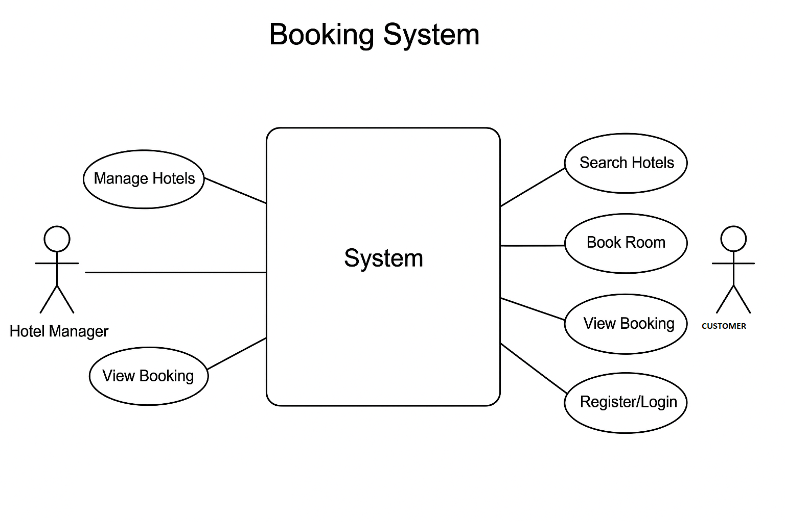

# requirement-analysis
# Requirement Analysis in Software Development
This repository is dedicated to documenting, organizing, and analyzing software requirements for projects. It serves as a central place to capture functional requirements, non-functional requirements, user stories, and acceptance criteria.

## What is Requirement Analysis?
_Requirement Analysis is the process of identifying, gathering, analyzing, and documenting the needs and expectations of stakeholders for a software system. It is the first and most critical step in the Software Development Lifecycle (SDLC).

This phase ensures that developers, designers, and stakeholders share a clear, common understanding of what the system should achieve before actual coding begins._

## Why is Requirement Analysis Important?
1. Clarity of Goals
2. Cost and Time Efficiency
3. Improved Design and Development
4. Better Testing and Validation
5. Stakeholder Satisfaction

## Key Activities in Requirement Analysis
- **Requirement Gathering** is the process of collecting raw requirements from stakeholders such as clients, users, project managers, and business analysts.
- **Requirement Elicitation** goes beyond simply “gathering” needs — it is the interactive process of drawing out hidden, implicit, or conflicting requirements.
- **Requirement Documentation** ensures that gathered and elicited requirements are organized, structured, and written down clearly. This documentation is typically maintained in an SRS (Software Requirement Specification) document.
- **Requirement Analysis and Modeling**: This activity involves analyzing documented requirements to check for feasibility, conflicts, redundancies, and gaps. It also uses modeling techniques to visually represent requirements for easier understanding.
- **Requirement Validation** ensures that the requirements accurately reflect stakeholder needs and are testable, feasible, and complete before moving to the design phase.

# Types of Requirements
## Functional Requirements
Functional requirements describe what the system should do — the specific behaviors, features, and functions that the software must provide. They are directly tied to business goals and user needs.
Examples for the Booking Management Project:
Functional Requirements:
- User Registration & Login
- Search Hotels
- Booking a Room
- View Booking History
- Payment processing
- Hotel Management

## Non-functional Requirements
Non-functional requirements define how the system performs rather than what it does. They focus on quality attributes like performance, reliability, scalability, and security.
Examples for the Booking Management Project:
Non-functional Requirements:
- Performance & Speed
- Scalability
- Reliability & Availability
- Security
- Maintainability
- Data Consistency

# Use Case Diagrams
Use case diagrams are visual representations of the interactions between users (actors) and a system, illustrating the system’s functionality from the user’s perspective. They show who can do what with the system and how different features or processes are connected. The main benefits include clarifying system requirements, helping stakeholders and developers understand user interactions, and identifying system boundaries and responsibilities. They are especially useful for communicating requirements early in the software development lifecycle.

# Acceptance Criteria
Acceptance criteria are a critical part of requirement analysis because they define the specific conditions that a product or feature must meet to be considered complete and acceptable by stakeholders. They serve as a bridge between the business requirements and the development team’s implementation, ensuring clarity and shared understanding.
Example: Acceptance Criteria for Checkout Feature in a Booking Management System

Feature: Checkout
Acceptance Criteria:
The user can view a summary of their booking details before payment, including selected services, dates, and total cost.
The system accepts multiple payment methods (e.g., credit card, PayPal, mobile payment).
Payment is processed securely, and confirmation is displayed to the user upon successful transaction.
If payment fails, the system shows an appropriate error message and allows the user to retry.
After successful checkout, a confirmation email is sent to the user containing booking details and receipt.
The system updates availability and inventory in real-time to prevent overbooking.
The checkout process must be completed within 5 minutes to avoid session expiration.
